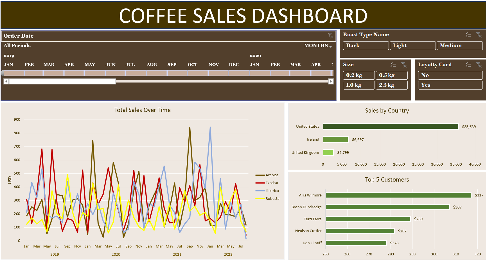

# Coffee Sales Performance Dashboard (Excel)

## Project Overview
This project involves a comprehensive analysis of coffee sales data from 2019 to 2022. 
The goal was to transform raw transactional data into a dynamic, interactive dashboard that allows stakeholders to track sales trends, identify top-performing regions, and understand customer loyalty patterns.

## Dashboard Preview

## Technical Workflow
The project was executed across three excel worksheets (orders, customers, products) using the following technical steps:
- Data Transformation: XLOOKUP, INDEX/MATCH, and IF statements to join multiple datasets and populate key variables such as Customer Name, Email, Coffee Type, Roast Type, and Loyalty Card status
- Data Aggregation: Leveraged Pivot Tables to summarize thousands of rows of data into actionable metrics
- Built Pivot Charts and integrated Slicers to enable real-time data filtering

## Findings
1. Sales Trends Over Time
- Volatility by type: Arabica and Excelsa beans show high volatility with significant spikes, particularly in late 2021 where Arabica reached a peak of over $800 in monthly sales.
- Seasonal peaks: There are visible recurring peaks in the fourth quarter (October-December) across multiple years, suggesting a seasonal demand for coffee products.

2. Regional Performance
- The United States is by far the largest market, contributing ** almost $36K** in total sales, more than triple the combined sales of Ireland ($6,697) and the United Kingdom ($2,799)
- Given the massive lead of the US, there is significant potential for growth in European markets

3. Customer Insights
- The dashboard identifies the Top 5 customers, led by Allis Wilmore ($317) and Brenn Dundredge ($307)
- Loyalty segment: The Top 5 Customers chart uses a specific value range (250–320) to highlight the narrow margins between the most loyal high-spenders

## Strategic Recommendations
- Targeted loyalty campaigns: Since the US is the primary revenue driver, localised loyalty programs or "Refer a Friend" schemes should be piloted there first to maximize ROI.
- Product diversification: With Arabica being a high-volume but volatile performer, marketing efforts could focus on stabilising the sales of Robusta or Liberica during "off-peak" months to ensure steady cash flow.
