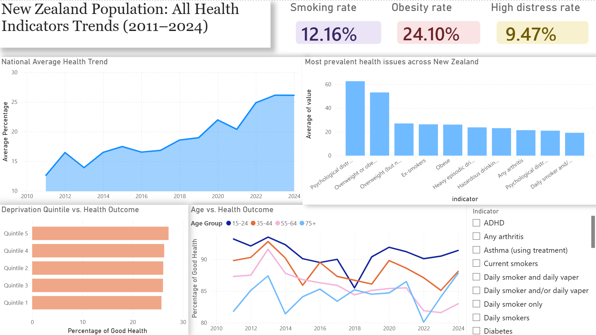
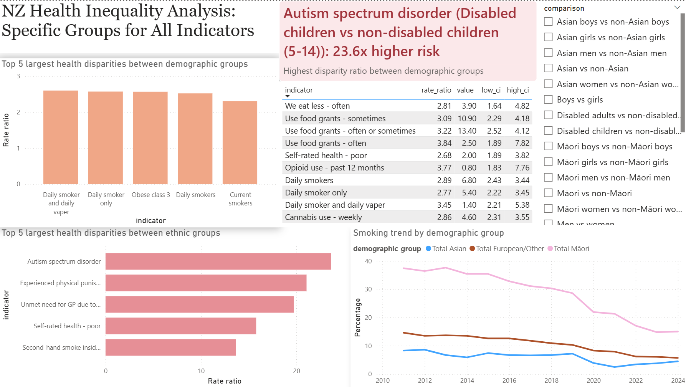

# New Zealand Health Inequality Analysis (2011–2024)

## Project Overview
This project analyzes health inequalities in New Zealand using data from the NZ Health Survey (2011–2024). 
The goal is to identify key disparities across demographic groups, examine long-term trends, and communicate insights through SQL analysis and PowerBI dashboards.

## Key Questions
- Which health issues are most prevalent nationally?
- Which demographic groups face the highest health risks?
- Where are the largest health inequalities?
- Are disparities improving or worsening over time?

## Tech Stack
- SQL (SQLite) – Data cleaning, transformation, analysis
- PowerBI – Interactive dashboards & visualisation
- Excel – Data source and preprocessing

## Data Pipeline
Raw Data → SQL Cleaning → Analytical Tables → PowerBI → Insights

### Final Tables:
- final_prevalences → Health indicator prevalence by group
- final_rate_ratios → Inequality measures between groups
- final_time_series → Trends from 2011–2024

## Key Analyses
1. Most Prevalent Health Issues: Identified top health indicators nationally (2024 snapshot)
2. Trend Analysis (2011-2024)
3. Largest Health Disparities: Focused on statistically significant inequalities (CI > 1)
4. Ethnic Inequality (Māori vs non-Māori)

## Dashboards

Two PowerBI dashboards were created:
1. National Trends Dashboard
- Time-series trends (2011–2024)
- Smoking, obesity, mental health indicators
- Age and deprivation comparisons

2. Health Inequality Dashboard
- Top disparities between demographic groups
- Ethnic comparisons
- Risk ratios with confidence intervals

## Key Insights

- Māori populations experience higher health risks across multiple indicators
- Smoking rates declined overall but disparities remain
- A clear socioeconomic gradient exists in health outcomes. Individuals living in the most deprived areas (Quintile 5) report significantly lower levels of good health compared with those in the least deprived areas (Quintile 1).
- High psychological distress is one of the fastest growing health concern, affecting approximately 14% of New Zealand population.
- Some of the largest disparities exist between disabled and non-disabled populations

---

## How to View
Download the `.pbix` file and open using Power BI Desktop.
