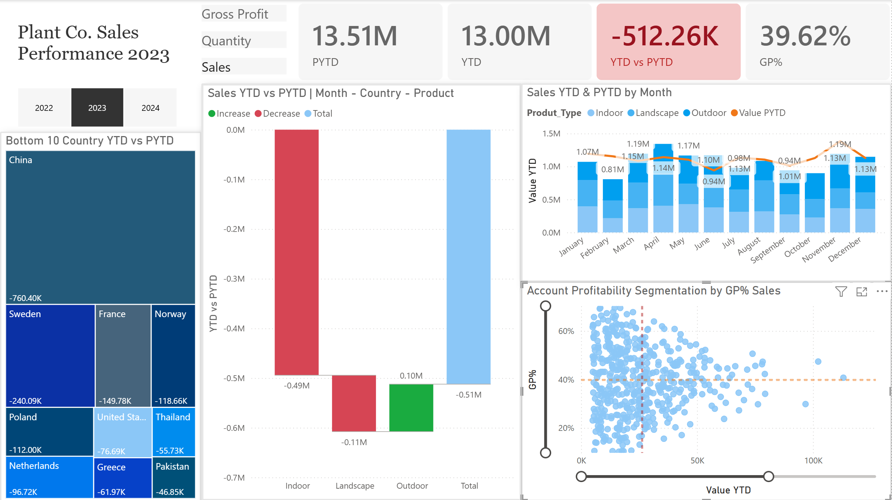

# Plant Co. Performance Dashboard – Power BI

## Project Overview
This interactive Power BI dashboard analyzes sales performance across time, product categories, and profitability metrics. It includes Year-to-Date (YTD) and Previous Year-to-Date (PYTD) comparisons. 
While the company maintained a healthy 39.6% Gross Profit margin, the analysis reveals a $512K revenue shortfall in 2023 compared to 2022. Key features include a dynamic waterfall chart for monthly 
variance tracking, drill through country, product and a profitability segmentation scatter plot to identify high-performing accounts. The report enables leadership to identify underperforming regions 
(like China with a sales figure of negative $760K) and optimize product mix strategies.

---

## Tools Used
- Power BI Desktop
- DAX (Time Intelligence, SWITCH logic)
- Data Modelling
- GitHub

---

## Features
- Dynamic metric selection using slicer + SWITCH
- Conditional formatting: using red/blue indicators for performance variance
- YTD vs PYTD comparison
- Time intelligence calculations
- Interactive filtering
- Clean KPI cards and trend visuals

---

## DAX Concepts Used
- TOTALYTD()
- SAMEPERIODLASTYEAR()
- CALCULATE()
- SWITCH()
- SELECTEDVALUE()
- Time intelligence logic with Date table

---

## Dashboard Preview

---

## Findings and Recommendations
- Address regional underperformance: Prioritize a strategic review of the China market, which currently shows a significant YTD deficit of -$760.40K
- Waterfall chart reveals that the overall sales dip in 2023 is primarily driven by Indoor Product segment (-$494K in Sales), specifically Sweden and Thailand markets. Suggested approach is conducting a localised
market audit in these regions to determine if the decline is due to increased shipping costs, shifting consumers preference, or local competitor pricing
- Outdoor Product line consistently delivers positive YTD sales growth and healthy Gross Profit margins. Company can consider reallocate a portion of Q3/Q4 marketing budget from underperforming Indoor lines toward
Outdoor promotions 
- Waterfall chart shows that February, October and November observed significant negative impact on Sales, in the China market, which suggests seasonal trends and company should consider seasonal
promotions or inventory adjustments to bridge these gaps in the future
- The scatter plot identifies a cluster of accounts with GP% above 40% but lower sales volume. Since data shows that Outdoor products bring high sales and margins, suggested approach is training the sales forces
to prioritise selling Outdoor bundles to these customers to move them to the high-profit zone
- The bar & line chart demonstrates 2024 performance trend, while the year began with a strong surplus in February driven by Landscape product demand, there is a concerning downward trend starting in March. By April,
actual sales fell significantly below the Prior Year (PYTD) benchmark (0.63M vs 0.39M), cross-reference this with the treemap for 2024, which reveals the underperformance of Canada and Columbia (specifically for
Outdoor lines with sales figure of -$55K)

---

## How to View
Download the `.pbix` file and open using Power BI Desktop.
